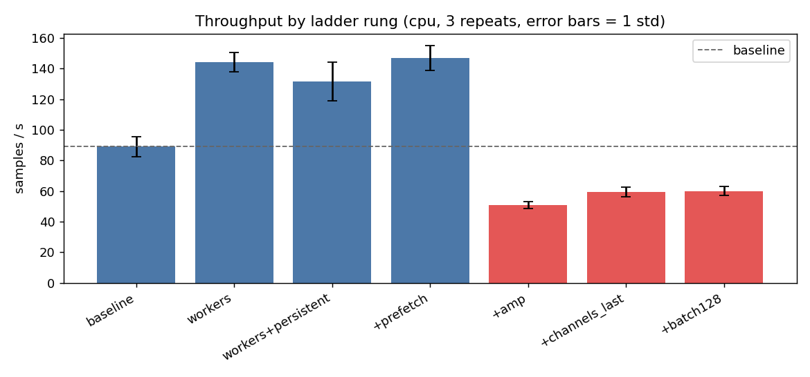
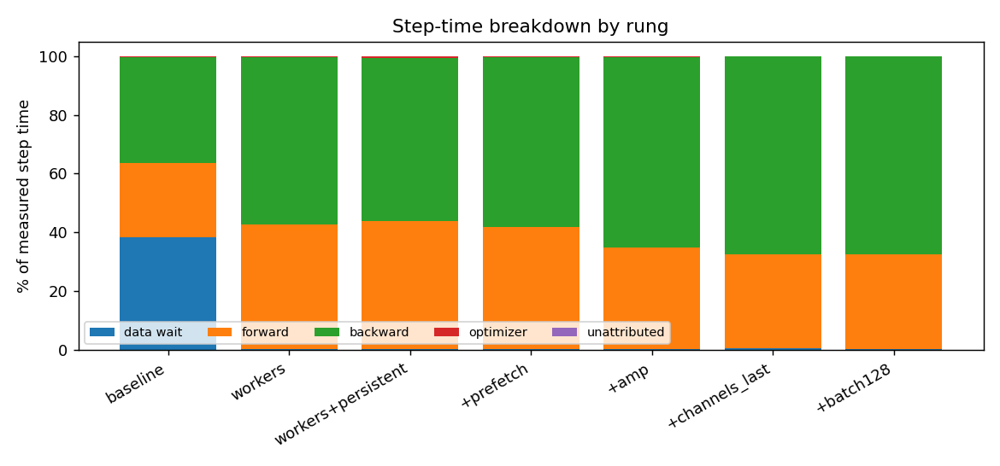

# Optimisation ladder: where the time went

Generated by `python -m trainlab.report`. Every number and figure below comes
from `results/ladder_*.json`; nothing is hand-typed.

## Setup

| | |
|---|---|
| device | `cpu` (Intel64 Family 6 Model 126 Stepping 5, GenuineIntel) |
| torch | 2.11.0+cpu |
| timer | `perf_counter` |
| steps per run | 30 (after warmup, which is excluded) |
| repeats per rung | 3, reported as mean ± std |
| synthetic per-sample decode cost | 400 |

## Baseline profile: the measurement that set the rung order

The instrumented FP32 baseline runs at **89.0 samples/s** with
**38% of step time in data wait**. That single number decides
everything that follows: while the compute device is idle a third of the time
waiting for input, no kernel-level optimisation can help, because the kernels are
not the constraint. The ladder therefore attacks the dataloader first and only
then moves to precision and layout.

This is the difference between profiling-driven and blog-post-driven: the obvious
first move (mixed precision) would have been the wrong one, and the profile says
so before any time is spent on it.

## The ladder

| rung | samples/s (mean ± std) | Δ vs prev | cumulative | data % | fwd % | bwd % | opt % | note |
|---|---|---|---|---|---|---|---|---|
| baseline | 89.0 ± 6.5 | — | 1.00x | 38 | 25 | 36 | 0 | instrumented FP32 reference, single-process loading |
| workers | 144.0 ± 6.3 | +62% | 1.62x | 0 | 42 | 57 | 0 | attack the profiled data-wait stall |
| workers+persistent | 131.4 ± 12.7 | -9% | 1.48x | 0 | 44 | 56 | 0 | stop paying worker startup every epoch |
| +prefetch | 146.9 ± 8.1 | +12% | 1.65x | 0 | 42 | 58 | 0 | deeper queue to absorb jitter in per-sample cost |
| +pin_memory | _skipped_ | — | — | — | — | — | — | CUDA-only rung; no effect on cpu |
| +tf32 | _skipped_ | — | — | — | — | — | — | CUDA-only rung; no effect on cpu |
| +amp | 50.8 ± 2.2 | -65% | 0.57x | 0 | 35 | 65 | 0 | mixed precision; bf16 chosen over fp16, see REPORT |
| +channels_last | 59.4 ± 3.3 | +17% | 0.67x | 1 | 32 | 67 | 0 | NHWC layout for conv kernels |
| +batch128 | 60.0 ± 3.1 | +1% | 0.67x | 0 | 32 | 67 | 0 | batch doubled WITH the pre-declared linear LR rule + warmup |
| +compile | _failed_ | — | — | — | — | — | — | InductorError |

## Best configuration

`+prefetch` at **146.9 samples/s**, a **1.65x** cumulative
speedup over the instrumented baseline.

## What is and is not separable

* `workers` -> `workers+persistent`: gap 12.6 samples/s is smaller than the combined spread 19.0. **Not separable at this sample size.**
* `workers+persistent` -> `+prefetch`: gap 15.5 samples/s is smaller than the combined spread 20.9. **Not separable at this sample size.**
* `+channels_last` -> `+batch128`: gap 0.6 samples/s is smaller than the combined spread 6.3. **Not separable at this sample size.**

## Negative results (kept)

Rungs that lost are in the table above with their real numbers. They are the most
informative rows in it: a ladder where every rung wins is a ladder that was
edited after the fact.

## Reading this report on other hardware

The rung *order* generalises (fix the profiled bottleneck first); the rung
*results* do not. Re-run `python -m trainlab.ladder` on the target device and
regenerate this report. Rows measured on different devices are never merged into
one table -- each row records its own device, timer and torch version for exactly
that reason.
